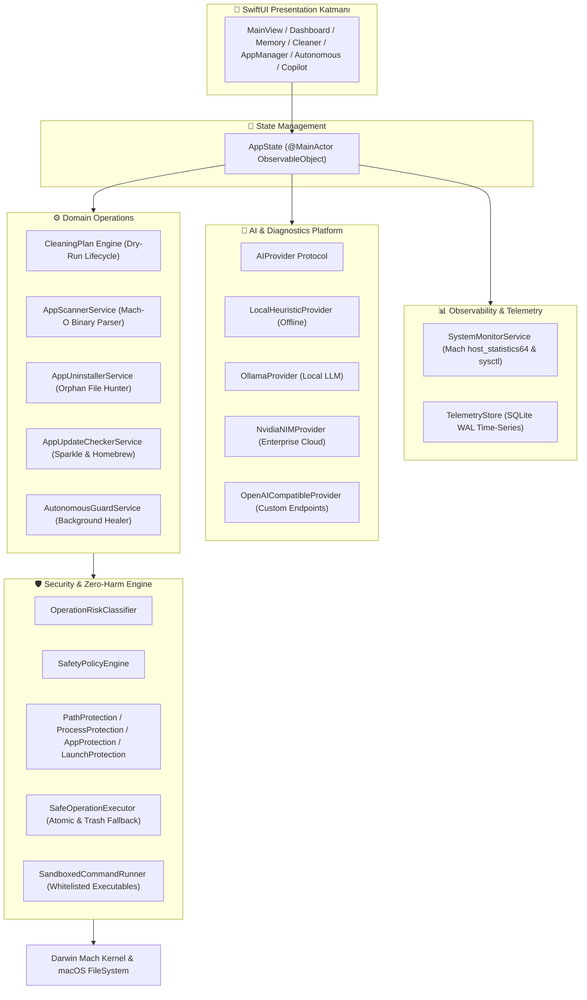

# 🏛️ MacOptimizer Pro Architecture

MacOptimizer Pro is designed with a **Clean, Layered, Unidirectional Data Flow (UDF)** architecture, ensuring high performance, memory safety, and defense-in-depth protection.

---

## 🏗️ System Overview

---

## 🧩 Architectural Layers

### 1. Presentation Layer (`Views/`)
* **SwiftUI + Liquid Glass Design System**: Dynamic blurred backgrounds, responsive grids (`LazyVGrid` with `GridItem(.adaptive(minimum: ...))`), and smart toolbar folding with `ViewThatFits`.
* **Zero UI Lag**: All telemetry computations, directory tree scanning, and network requests are executed on background actors.

### 2. State Layer (`AppState.swift`)
* `@MainActor ObservableObject` that acts as the single source of truth for navigation, live gauges, AI recommendations, watchdog alarms, and background scan progress.

### 3. Security Engine (`Core/Security/`)
* **`OperationRiskClassifier`**: Classifies operations into `.safe`, `.low`, `.medium`, `.destructive`, and `.forbidden`.
* **`PathProtectionPolicy`**: Canonicalizes paths with `URL.resolvingSymlinksInPath()` and protects system roots and user personal directories.
* **`ProcessProtectionPolicy`**: Shields PID 0/1 and 35+ critical macOS daemons from being killed.
* **`SafeOperationExecutor`**: Governs actual file removals and process termination.

### 4. Telemetry & Storage (`Core/Telemetry/`)
* **`SystemMonitorService`**: Reads Mach VM statistics (`host_statistics64`) and kernel sysctl values in microseconds with near-zero CPU and battery footprint.
* **`TelemetryStore`**: Embedded SQLite database operating in WAL (Write-Ahead Logging) mode for thread-safe downsampled historical metrics.

### 5. Multi-Provider AI Platform (`Infrastructure/AI/`)
* Completely decoupled from raw system commands. AI generates structured `AIInsight` and `AIAction` recommendations which must pass through the `SafetyPolicyEngine` and require user confirmation before execution.
