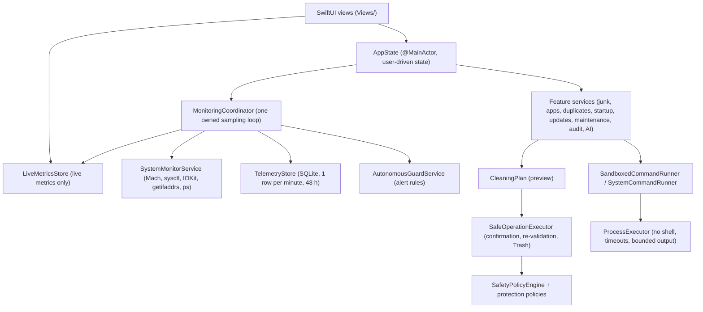

# MacOptimizer Pro Architecture

This document describes how the code is organised today. Paths are relative to
`Sources/MacOptimizer/`.

## Package

- One SwiftPM `executableTarget` (`MacOptimizer`) and one `testTarget` (`MacOptimizerTests`).
- swift-tools 6.0, Swift 6 language mode (strict concurrency), macOS 14 or later.
- No third-party dependencies. Localized resources live in `Resources/{en,tr}.lproj`.

## Entry point

`App/MacOptimizerApp.swift` has a custom `@main`:

- If `CLICommandRunner.shouldHandleCLI()` recognises a command (`status`, `clean`, `version`,
  `help`), the CLI runs and the process exits.
- Otherwise the SwiftUI app starts with a main window (`MainView`) and a `MenuBarExtra`.

## Overview

```mermaid
graph TD
    Views["SwiftUI views (Views/)"] --> AppState["AppState (@MainActor, user-driven state)"]
    Views --> Metrics["LiveMetricsStore (live metrics only)"]
    AppState --> Coordinator["MonitoringCoordinator (one owned sampling loop)"]
    Coordinator --> Monitor["SystemMonitorService (Mach, sysctl, IOKit, getifaddrs, ps)"]
    Coordinator --> Metrics
    Coordinator --> Telemetry["TelemetryStore (SQLite, 1 row per minute, 48 h)"]
    Coordinator --> Watchdog["AutonomousGuardService (alert rules)"]
    AppState --> Services["Feature services (junk, apps, duplicates, startup, updates, maintenance, audit, AI)"]
    Services --> Plan["CleaningPlan (preview)"]
    Plan --> Executor["SafeOperationExecutor (confirmation, re-validation, Trash)"]
    Executor --> Policy["SafetyPolicyEngine + protection policies"]
    Services --> Runners["SandboxedCommandRunner / SystemCommandRunner"]
    Runners --> ProcExec["ProcessExecutor (no shell, timeouts, bounded output)"]
```

## Layers

| Folder | Contents |
| --- | --- |
| `App/` | `AppState`: a `@MainActor ObservableObject` singleton holding navigation, scan results, alerts, chat and history. `MacOptimizerApp` and the menu bar view. |
| `Core/Monitoring/` | `MonitoringCoordinator` (one owned async loop), `MetricsSchedulePolicy` (which metric tiers are due, depending on visibility and the watchdog), `LiveMetricsStore` (publishes only changed metric values). |
| `Core/Concurrency/` | `ProcessExecutor` (child processes with concurrent pipe draining, output cap, SIGTERM then SIGKILL on timeout, cancellation), `runBlocking`, `CancellationFlag`, `ProgressThrottle`, `RingBuffer`. |
| `Core/Security/` | `PathProtectionPolicy`, `ProcessProtectionPolicy`, `ApplicationProtectionPolicy`, `LaunchItemProtectionPolicy`, `SafetyPolicyEngine`, `OperationRiskClassifier`, `SafeOperationExecutor`. |
| `Core/Operations/` | `CleaningPlan`, `CLICommandRunner`, `SandboxedCommandRunner` (allow-list of absolute executable paths). |
| `Core/Telemetry/` | `TelemetryStore`: SQLite in WAL mode at `~/Library/Application Support/com.osmancagrigenc.MacOptimizer/telemetry.sqlite`, downsampled in SQL when read. |
| `Services/` | `SystemMonitorService`, `JunkCleanerService`, `AppScannerService`, `AppUninstallerService`, `AppUpdateCheckerService`, `DuplicateFileFinderService`, `StartupManagerService`, `MaintenanceService`, `PrivacyAuditService`, `MemoryOptimizerService` (process termination only), `AutonomousGuardService`, `AIAssistantService`, `NvidiaNIMService`. Most are actors; the scanners are stateless `Sendable` classes that do blocking I/O off the cooperative thread pool. Each has a `.shared` instance. |
| `Infrastructure/AI/` | The `AIProvider` protocol with two implementations: `LocalHeuristicProvider` (offline, default) and `NvidiaNIMProvider` (cloud, opt-in). |
| `Infrastructure/Persistence/` | `KeychainManager` (`kSecAttrAccessibleWhenUnlockedThisDeviceOnly`), used for the NVIDIA NIM API key. |
| `Helpers/` | `SafetyGuard` (older checks still used for processes, apps and launch items), `SystemCommandRunner` (runs a given executable with arguments, no shell), `XMLParserHelper` (Sparkle appcasts), `FileSizeCalculator`, `MachOArchitectureDetector`, `VersionComparator`, `ByteFormatter`. |
| `Models/` | Value types for metrics, junk items, apps, alerts, AI and watchdog configuration. |
| `Views/` | Feature screens: Dashboard, Memory, Junk Cleaner, Duplicate Finder, App Manager, Updates, Startup, Maintenance, Security, History, Watchdog, AI, Settings, plus shared components. |
| `L10n.swift` | Localization helper over the per-area string tables (see [docs/LOCALIZATION.md](docs/LOCALIZATION.md)). |

## Monitoring

`MonitoringCoordinator` runs a single loop. Each metric tier (core, disk, battery, telemetry,
hardware, processes) has its own interval, and the loop slows down when the window is hidden:
2.5 s for core metrics while visible, 10 s while hidden with the watchdog on, 60 s while hidden
and idle. `/bin/ps` runs only when a process list or the watchdog needs it. Details and the
measurements behind them are in [docs/PERFORMANCE_REPORT.md](docs/PERFORMANCE_REPORT.md).

The watchdog is `AutonomousGuardService`, evaluated by this loop. It therefore runs only while
the app process is running; there is no LaunchAgent or background helper.

## Destructive operations

1. A scan builds a `CleaningPlan`. Paths are canonicalised and classified; forbidden paths and
   Trash items are left out of the plan.
2. The UI shows the plan. The CLI prints it and needs `--execute --yes`.
3. `SafeOperationExecutor.removeFile` evaluates the path with `SafetyPolicyEngine`, throws when a
   `requiresConfirmation` decision has no confirmation, re-resolves the path before acting, and
   moves the item to the Trash. Permanent removal is allowed only for paths accepted by
   `PathProtectionPolicy.isCleanableCachePath`.
4. `SafeOperationExecutor.emptyTrash` permanently removes entries that are directly inside
   `~/.Trash`, after a separate confirmation.

The junk cleaner, uninstaller, duplicate finder and startup manager all call the executor with
`moveToTrash: true`.

## Commands

- `SandboxedCommandRunner` runs only executables from the `ApprovedExecutable` allow-list
  (`dscacheutil`, `killall`, `mdutil`, `qlmanage`, `lsregister`, `atsutil`, `launchctl`,
  `csrutil`, `spctl`, `defaults`, `socketfilterfw`), drops arguments containing shell
  metacharacters, and has a 15 s default timeout.
- `SystemCommandRunner` runs a fixed executable with an argument array (used for `/bin/ps`,
  `/bin/kill` and `brew`). There is no shell execution anywhere in the app.

## Data and persistence

| Data | Where |
| --- | --- |
| Settings, AI and watchdog configuration, operation history (last 500) | UserDefaults (`MacOptimizer_NIMConfig`, `MacOptimizer_AutonomousConfig`, `MacOptimizer_History`, …) |
| NVIDIA NIM API key | Keychain |
| Telemetry time series (1 row per minute, pruned after 48 h) | SQLite file above, not encrypted |

There is no audit log of file operations.

## Networking

- NVIDIA NIM (`https://integrate.api.nvidia.com/v1`), only when the user enabled it. Plain HTTP is
  refused except for localhost.
- Sparkle appcasts of installed apps (plain HTTP feeds are allowed).
- The VS Code update API.
- `brew`, which may contact its own servers.

## Build and release

- `Scripts/build_app.sh` builds a release binary and assembles `MacOptimizer.app` with a generated
  Info.plist. It does not sign the app.
- GitHub Actions: `ci.yml` (build, full test suite, host-state canary, app bundle), `release.yml`
  (DMG and build-provenance attestation on tags, no signing yet), `security.yml` (Gitleaks and a
  dependency inventory).
- Developer ID signing, notarization and a single version source are being added for v3.1.0.

## Known limitations

- `AppState` is large and several views call services directly.
- Two safety layers overlap: `Helpers/SafetyGuard` and `Core/Security`.
- Services are singletons without dependency injection (tests inject runners and directories
  where needed).
- Homebrew update detection parses `brew outdated --json=v2` and has not been verified against
  every Homebrew version.
