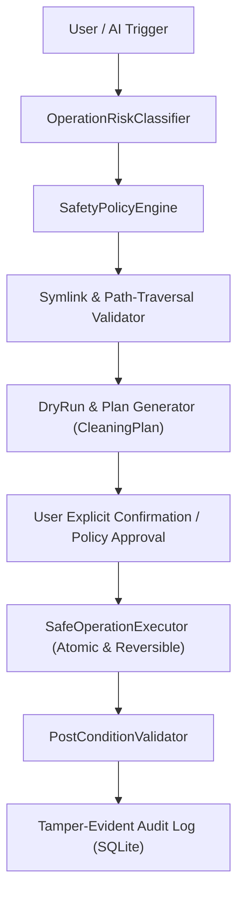

# 🚀 MASTER_IMPLEMENTATION_PROMPT: MacOptimizer Pro v3.0 Transformation

> **Mission**: Transform MacOptimizer into an enterprise-grade, security-first, open-source **Native macOS System Health & Optimization Toolkit** governed by a **Zero-Harm Architecture (Defense-in-Depth)**.
> **Target Platform**: macOS 14.0+ (Sonoma, Sequoia & future macOS versions) on Apple Silicon (M1/M2/M3/M4) and Intel (x86_64).
> **License**: Apache License 2.0

---

## 🎯 Architecture Transformation Goals

```text
From: Traditional Cleaner & Optimizer App
To:   Security-First, Auditable, Native macOS System Health & Optimization Toolkit
```



---

## 📋 Comprehensive 10-Phase Implementation Roadmap

---

### Phase 1: Security & Zero-Harm Policy Engine (P0)

#### 1.1 Risk Classification & Operation Hierarchy
Create `Core/Security/OperationRiskClassifier.swift`:
```swift
public enum OperationRisk: String, Comparable, CaseIterable, Sendable {
    case safe          // Read-only metrics, hardware telemetry, benchmark runs
    case low           // In-memory RAM purge, flush DNS, reset QuickLook cache
    case medium        // Delete isolated user app caches, kill normal user processes
    case destructive   // Uninstall entire 3rd-party application, purge large log bundles
    case forbidden     // System root deletion, PID 0/1 termination, deleting ~/Documents, modifying SIP
    
    public static func < (lhs: OperationRisk, rhs: OperationRisk) -> Bool {
        let order: [OperationRisk] = [.safe, .low, .medium, .destructive, .forbidden]
        guard let lIdx = order.firstIndex(of: lhs), let rIdx = order.firstIndex(of: rhs) else { return false }
        return lIdx < rIdx
    }
}
```

#### 1.2 Modular Policy Engine Architecture
Refactor the monolithic `SafetyGuard.swift` into modular policy evaluators under `Core/Security/`:
* `PathProtectionPolicy.swift`: Strict canonical path checking using `URL.resolvingSymlinksInPath()`. Resolves symlinks before evaluating parent/ancestor protection. Explicitly blocks:
  * Kök dizinler: `/`, `/System`, `/System/Applications`, `/System/Library`, `/Library`, `/usr`, `/bin`, `/sbin`, `/var`, `/etc`, `/dev`, `/private`
  * Kullanıcı kök ve veri dizinleri: `~`, `~/Desktop`, `~/Documents`, `~/Downloads`, `~/Movies`, `~/Music`, `~/Pictures`, `~/Library`, `~/Library/Keychains`, `~/Library/Mail`, `~/.ssh`, `~/.gnupg`, `~/.aws`, `~/.config`
* `ProcessProtectionPolicy.swift`: Protects kernel tasks, launch daemons, login window, WindowServer, Dock, Finder, TCCD, securityd, opendirectoryd, and coreauthd.
* `ApplicationProtectionPolicy.swift`: Prevents uninstallation of system apps in `/System/Applications` and apps matching `com.apple.*`.
* `LaunchItemProtectionPolicy.swift`: Restricts modification of `/Library/LaunchDaemons` and system agents.
* `OperationRiskClassifier.swift`: Classifies every target action with explicit risk ratings.
* `SafeOperationExecutor.swift`: Enforces `trashItem` moves with transactional rollback capability where possible.

#### 1.3 Strict Sandboxing for Command Execution
Replace raw shell execution in `Helpers/SystemCommandRunner.swift` with whitelist-only typed execution:
```swift
public enum ApprovedExecutable: String, Sendable {
    case dscacheutil = "/usr/bin/dscacheutil"
    case killall     = "/usr/bin/killall"
    case mdutil      = "/usr/bin/mdutil"
    case qlmanage    = "/usr/bin/qlmanage"
}

public struct SandboxedCommandRunner {
    public static func run(
        executable: ApprovedExecutable,
        arguments: [String],
        timeoutSeconds: TimeInterval = 15.0
    ) async throws -> CommandResult
}
```

#### 1.4 Dry-Run & Two-Phase Cleaning Engine
Refactor `JunkCleanerService` to follow a mandatory **Dry-Run Plan → Preview → Approval → Execution** lifecycle:
```swift
public struct CleaningPlan: Identifiable, Sendable {
    public let id: UUID
    public let createdAt: Date
    public let itemsToClean: [CleanableItemPlan]
    public let totalEstimatedBytes: Int64
    public let maxRiskLevel: OperationRisk
    public let warnings: [String]
}

public protocol CleaningPlanEngine {
    func generateDryRunPlan(categories: Set<JunkCategoryType>) async -> CleaningPlan
    func executePlan(_ plan: CleaningPlan, onProgress: @Sendable (Double, String) -> Void) async -> CleaningResult
}
```

---

### Phase 2: Keychain Secret Management & Privacy Hardening

#### 2.1 macOS Keychain Integration
* Remove any plain-text API keys from `UserDefaults`.
* Create `Infrastructure/Persistence/KeychainManager.swift` utilizing macOS `Security` framework (`SecItemAdd`, `SecItemCopyMatching`, `SecItemUpdate`, `SecItemDelete`) with `kSecAttrAccessibleWhenUnlockedThisDeviceOnly`.
* Create automated migration logic in `AppState` to migrate legacy `UserDefaults` keys into the secure Keychain on first launch.
* Add `.gitleaks.toml` configuration to ensure no credentials can be committed.

---

### Phase 3: AI Decoupling & Vendor-Agnostic Multi-Provider Platform

#### 3.1 Provider Protocol Interface
Create `Infrastructure/AI/AIProvider.swift`:
```swift
public protocol AIProvider: Sendable {
    var providerId: String { get }
    var displayName: String { get }
    var requiresNetwork: Bool { get }
    
    func diagnose(snapshot: SystemSnapshot) async throws -> [AIInsight]
    func queryCopilot(history: [ChatMessage], prompt: String, snapshot: SystemSnapshot) async throws -> AsyncThrowingStream<String, Error>
}
```

#### 3.2 Implemented Providers
* `LocalHeuristicProvider`: 100% offline, privacy-first, zero-network rule-based diagnostic engine.
* `OllamaProvider`: Connects to local Ollama instance (`http://localhost:11434`) for offline local LLMs (e.g. `llama3.2`, `qwen2.5-coder`, `deepseek-r1:8b`).
* `NvidiaNIMProvider`: Cloud enterprise inference via HTTPS API (`build.nvidia.com`).
* `OpenAICompatibleProvider`: Generic provider supporting custom self-hosted vLLM, LM Studio, or OpenAI endpoints.

#### 3.3 Strict Structured Action Proposals
AI agents cannot trigger execution directly. AI outputs an `ActionProposal`:
```swift
public struct ActionProposal: Identifiable, Codable, Sendable {
    public let id: String
    public let type: ActionType
    public let target: String
    public let risk: OperationRisk
    public let justification: String
}
```
All proposals are routed through the `SafetyPolicyEngine` and require explicit user authorization.

---

### Phase 4: High-Performance Observability & Telemetry Store (SQLite)

#### 4.1 Downsampled Time-Series Engine
Create `Core/Telemetry/TelemetryStore.swift` using SQLite with WAL mode:
* **High-Resolution (5-second intervals)**: Preserved for the last 1 hour.
* **Medium-Resolution (1-minute intervals)**: Downsampled average for the last 24 hours.
* **Low-Resolution (15-minute intervals)**: Downsampled summary for the last 30 days.
* Tracks: CPU usage, Memory pressure %, Swap bytes, Thermal state, Battery health, Disk IO, Top memory processes.

---

### Phase 5: Reorganizing Directory Structure (Feature + Domain Hybrid)

Migrate the codebase from the flat structure into:

```text
MacOptimizer/
├── App/
│   ├── MacOptimizerApp.swift
│   ├── AppState.swift
│   └── NavigationTab.swift
│
├── Core/
│   ├── Domain/
│   │   ├── Models/
│   │   └── Protocols/
│   ├── Security/
│   │   ├── SafetyPolicyEngine.swift
│   │   ├── PathProtectionPolicy.swift
│   │   ├── ProcessProtectionPolicy.swift
│   │   ├── ApplicationProtectionPolicy.swift
│   │   ├── LaunchItemProtectionPolicy.swift
│   │   ├── OperationRiskClassifier.swift
│   │   └── SafeOperationExecutor.swift
│   ├── Telemetry/
│   │   ├── SystemTelemetryEngine.swift
│   │   └── TelemetryStore.swift
│   └── Operations/
│       ├── CleaningPlan.swift
│       └── SandboxedCommandRunner.swift
│
├── Features/
│   ├── Dashboard/
│   ├── Cleaner/
│   ├── AppManager/
│   ├── StartupManager/
│   ├── Memory/
│   ├── Maintenance/
│   ├── AutonomousGuard/
│   ├── AICopilot/
│   └── History/
│
├── Infrastructure/
│   ├── Darwin/
│   ├── FileSystem/
│   ├── Persistence/
│   ├── Networking/
│   └── AI/
│
├── Shared/
│   ├── DesignSystem/
│   ├── Components/
│   └── Utilities/
│
├── Tests/
│   ├── MacOptimizerTests/
│   ├── SafetyTests/
│   ├── IntegrationTests/
│   └── PerformanceBenchmarks/
│
└── Docs/
```

---

### Phase 6: Test Suite Expansion (Target: 100+ Tests)

Expand `Tests/` into modular test targets:

1. **Property-Based Safety Tests (`SafetyTests/PathProtectionTests.swift`)**:
   * Generate 1000+ synthetic paths including `../`, symlinks to protected areas, escaped Unicode paths, nested root dirs, and verify `SafetyPolicyEngine` denies them with 100% precision.
2. **Symlink Traversal Attack Tests (`SafetyTests/SymlinkAttackTests.swift`)**:
   * Create temporary directory structures containing symlinks pointing to `/System`, `~/Documents`, `~/.ssh` and verify `resolvingSymlinksInPath()` prevents accidental traversal.
3. **Dry-Run Plan Tests (`UnitTests/CleaningPlanTests.swift`)**:
   * Verify that `generateDryRunPlan` does not alter disk state and calculates exact preview byte sizes.
4. **Mach-O Binary Parser Tests (`UnitTests/MachOTests.swift`)**:
   * Verify correct detection of Fat Universal, ARM64, and x86_64 headers.
5. **AI Proposal Validation Tests (`UnitTests/AIProposalTests.swift`)**:
   * Verify that hostile/hallucinated AI proposals (e.g. `rm -rf /`) are rejected by the safety classifier.
6. **Telemetry Downsampling Tests (`UnitTests/TelemetryStoreTests.swift`)**:
   * Verify aggregation accuracy across 1h, 24h, and 30d time buckets.

---

### Phase 7: Performance Benchmarks Suite

Create `Benchmarks/MacOptimizerBenchmarks.swift`:
* `MachOHeaderDetectionBenchmark`: Compare direct header parsing vs subprocess `lipo`.
* `KernelTelemetryBenchmark`: Measure Darwin `host_statistics64` latency (< 0.05 ms baseline).
* `JunkParallelScanBenchmark`: Measure 10,000 file scanning duration across `TaskGroup` workers.
* Record benchmark baselines in `BENCHMARKS.md` with reproducible hardware setups.

---

### Phase 8: Community & Open Source Documentation

Generate root documentation adhering to GitHub best practices:
1. `README.md`: Clear, professional pitch highlighting **Zero-Harm Architecture (Defense-in-Depth)**, native Swift/SwiftUI performance, local/cloud AI options, and screenshots.
2. `LICENSE`: Apache License 2.0.
3. `SECURITY.md`: Vulnerability disclosure policy, threat model, and zero-harm guarantees.
4. `CONTRIBUTING.md`: Coding standards, SwiftLint / SwiftFormat rules, branching model.
5. `ARCHITECTURE.md`: Detailed component diagrams, security boundary definitions, and data flow.
6. `PRIVACY.md`: Explicit guarantee of offline-first telemetry and local credential storage.
7. `ROADMAP.md`: Release milestones from v2.1 to v3.0+.
8. `CHANGELOG.md`: Keep a Changelog format.
9. `THREAT_MODEL.md`: STRIDE analysis for macOS system utilities.

---

### Phase 9: Automated GitHub Actions CI/CD Pipeline

Create `.github/workflows/`:
1. `ci.yml`:
   * Matrix: macOS 14 & macOS 15 runners on Apple Silicon (`macos-14`, `macos-15`).
   * Steps: `swift-format lint`, `SwiftLint`, `swift build`, `swift test --enable-code-coverage`.
2. `security.yml`:
   * Dependency auditing (`swift package audit-dependencies`), Gitleaks secret scanning, SAST static analysis.
3. `release.yml`:
   * Trigger on version tags (`v*`).
   * Build release archive.
   * Codesign with Apple Developer ID certificate.
   * Submit to Apple Notarization Service using `xcrun notarytool`.
   * Staple notarization ticket (`xcrun stapler staple`).
   * Package into compressed `.dmg`.
   * Generate SHA-256 checksums (`MacOptimizer.dmg.sha256`).
   * Generate SPDX SBOM (`SBOM.spdx.json`).
   * Generate GitHub Artifact Attestation (`actions/attest-build-provenance`).
   * Publish GitHub Release.

---

### Phase 10: Verification, Build & Release Verification

1. Run full unit test suite: `swift test` (100+ tests passing).
2. Run benchmark suite.
3. Execute `./Scripts/build_app.sh` and verify `.app` bundle code signing and execution integrity.
4. Run full smoke test on macOS Sonoma / Sequoia.
