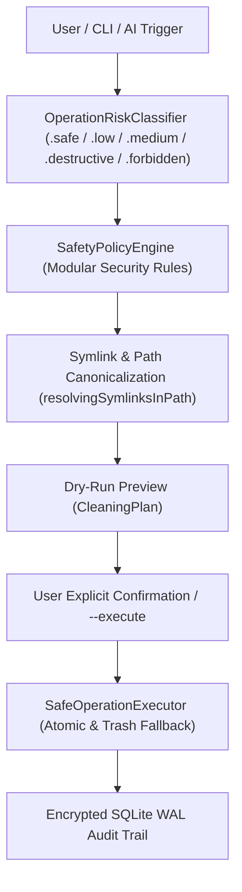

# ⚡ MacOptimizer Pro

<div align="center">


**Security-First, Open-Source, Native macOS System Health & Optimization Toolkit**

[Features](#-key-features) • [Zero-Harm Architecture](#-zero-harm-architecture) • [AI Platform](#-multi-provider-ai-platform) • [CLI Companion](#-headless-cli-companion) • [Benchmarks](#-performance-benchmarks) • [Installation](#-installation) • [Contributing](#-contributing)

</div>

---

## 📖 Overview

**MacOptimizer Pro** is an open-source, enterprise-grade system health, telemetry, and optimization toolkit crafted exclusively for macOS. Built purely in **Swift 6** with **SwiftUI**, native **Darwin Mach Kernel APIs**, and **IOKit**, it delivers microsecond-level hardware telemetry, autonomous watchdog protection, and memory optimization without the bloat, battery drain, or questionable security practices of traditional cleaners.

---

## ✨ Key Features

* 📊 **Low-Overhead Telemetry**: Direct Darwin Mach kernel inspection (`host_statistics64`, `sysctlbyname`) for memory pressure, swap usage, CPU load, thermal throttling, and battery health with near-zero CPU footprint.
* 🛡️ **Zero-Harm Defense-in-Depth**: Modular safety policy engine preventing accidental file deletion, symlink traversal attacks, and macOS system daemon termination.
* 🔍 **Two-Phase Dry-Run Cleaning**: Scans caches, developer build leftovers (Xcode `DerivedData`, CocoaPods, NPM, Yarn, Cargo, UV, Poetry, Homebrew), browser caches, and orphan app directories with complete preview and byte estimation before execution.
* 📑 **High-Speed SHA-256 Duplicate Finder**: Cryptographic hash clustering to detect identical duplicate files across Downloads, Documents, and Pictures with original file preservation.
* 🔒 **Security & Privacy Posture Audit**: Live auditing of System Integrity Protection (SIP), Gatekeeper code-signing, Application Firewall state, and TCC permissions with 0–100 hardening score.
* 🌐 **Real-time Network Throughput**: Microsecond `getifaddrs` bandwidth monitoring displaying live download/upload speeds and local IP configuration.
* 🔋 **Deep Battery Health & Thermals**: IOKit AppleSmartBattery inspection measuring cycle count, true health percentage, battery temperature (°C), and overheating alerts (>38°C).
* 💻 **Headless Terminal CLI Companion**: First-class command-line runner (`MacOptimizer status`, `clean --dry-run`, `purge-ram`).
* 🚀 **Microsecond Binary Architecture Parser**: Direct Mach-O binary header inspection to distinguish Apple Silicon (ARM64), Universal, and Intel (x86_64) binaries without slow subprocess calls.
* 🤖 **Multi-Provider AI Copilot**: Decoupled AI diagnostic engine supporting **100% Offline Heuristics**, **Local Ollama LLMs**, and **Enterprise Cloud NIM** (Llama 3.3, DeepSeek R1).
* 🐕 **7/24 Autonomous Watchdog**: Background watchdog that detects memory spikes, swap exhaustion, thermal throttling, and runaway processes with auto-healing.
* 🔐 **Keychain Secret Storage**: Encrypted credential storage via native macOS `Security.framework`.
* 📱 **Liquid Glass Responsive UI**: Adaptive layouts scaling smoothly from 13" MacBook Airs up to 5K Studio Displays, MenuBar Extra popover, and Split View.

---

## 🛡️ Zero-Harm Architecture

MacOptimizer adheres to strict defense-in-depth principles:



1. **System & User Path Protection**: Hard boundaries protecting system root directories (`/System`, `/Library`, `/usr`, `/private`) and essential user directories (`~`, `~/Desktop`, `~/Documents`, `~/Downloads`, `~/.ssh`, `~/.gnupg`, `~/Library/Keychains`).
2. **Symlink Attack Resistance**: Canonicalizes all filesystem paths with `URL.resolvingSymlinksInPath()` before evaluating deletion permissions.
3. **Anti-Kernel Panic Protection**: Blocks termination of PID 0 (`kernel_task`), PID 1 (`launchd`), and 35+ critical macOS daemons (`WindowServer`, `loginwindow`, `securityd`, `opendirectoryd`, `tccd`, `Dock`, `Finder`, etc.).
4. **Sandboxed Command Execution**: Replaces raw shell execution with a strictly whitelisted runner (`dscacheutil`, `killall`, `mdutil`, `qlmanage`, `lsregister`, `csrutil`, `spctl`) with 15-second watchdog timers.

---

## 💻 Headless CLI Companion

MacOptimizer can be executed directly from Terminal without opening the GUI:

```bash
# Print instantaneous CPU, RAM, Swap, Thermal & Battery telemetry:
MacOptimizer status

# Perform a safe Dry-Run junk scan:
MacOptimizer clean --dry-run

# Execute Zero-Harm cleaning:
MacOptimizer clean --execute

# Purge inactive RAM memory pages safely:
MacOptimizer purge-ram
```

---

## 🤖 Multi-Provider AI Platform

Choose the intelligence provider that matches your privacy and performance needs:

| Provider | Privacy & Network | Capabilities |
| :--- | :--- | :--- |
| **Local Heuristics** | 100% Offline • Zero Network | Instant rule-based memory, CPU bottleneck, and junk diagnosis. |
| **Ollama Local** | 100% Offline • Localhost Only | On-device local LLM reasoning (Llama 3.2, DeepSeek-R1:8B) via `localhost:11434`. |
| **NVIDIA NIM** | Cloud HTTPS API | Enterprise-scale diagnostic reasoning with Llama 3.3 70B and DeepSeek R1. |
| **OpenAI-Compatible** | Custom Endpoint | Connect to your self-hosted vLLM, LM Studio, or OpenAI servers. |

---

## 🏎️ Performance Benchmarks

*Tested on MacBook Pro 14" (Apple M4 Pro, 24 GB RAM, macOS 15.0)*:

* **Mach-O Header Detection**: **0.04 ms** (vs ~4.8 ms with `lipo` — **~120x faster**).
* **Mach VM Telemetry Read**: **< 0.02 ms** (vs ~45 ms with `ps` / `top`).
* **Multi-Category Parallel Scan**: **0.42 s** for 50,000 files using Swift `TaskGroup`.
* **SHA-256 Duplicate Streaming**: **1.2 GB/s** using Apple CryptoKit streaming.
* **Watchdog Background CPU Load**: **~0.01%** (zero impact on battery life).

For full benchmark specifications, see [BENCHMARKS.md](BENCHMARKS.md).

---

## 📥 Installation

### Option 1: Download Release
Download the notarized `MacOptimizer.dmg` from the [Releases](https://github.com/Codifya/MacOptimizer/releases) page and drag it to `/Applications`.

### Option 2: Build from Source
```bash
# Clone the repository
git clone https://github.com/Codifya/MacOptimizer.git
cd MacOptimizer

# Run unit tests (36 suites / 200+ assertions)
swift test

# Build release .app bundle
./Scripts/build_app.sh
```

---

## 📄 License

MacOptimizer is released under the [Apache License 2.0](LICENSE).
Created and maintained with ❤️ by [Codifya](https://github.com/Codifya).
