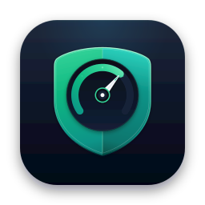

# MacOptimizer Pro

> **Safety notice:** Releases [v2.1.0–v3.0.0](https://github.com/Codifya/MacOptimizer/releases) contain known safety defects. Do not use them; use [v3.1.0](https://github.com/Codifya/MacOptimizer/releases/tag/v3.1.0) or later, the first Developer ID-signed and notarized release.

<div align="center">




**An open-source, native macOS system health and cleanup utility written in Swift and SwiftUI.**

[Features](#features) • [How deletion works](#how-deletion-works) • [AI assistant](#ai-assistant) • [Command line](#command-line) • [Installation](#installation) • [Contributing](#contributing)

</div>

---

## Overview

MacOptimizer Pro shows live system health (memory, swap, CPU, thermal state, disk, battery and
network), finds caches and other junk, uninstalls apps with their leftovers, finds duplicate files,
manages launch items and runs a few maintenance commands. It is a single SwiftPM package with no
third-party dependencies, and it reads system state through Darwin/Mach (`host_statistics64`,
`sysctl`, `getifaddrs`) and IOKit.

The app is not sandboxed, because it needs to read and clean files across your home folder. It
is therefore distributed outside the Mac App Store.

## Features

- **Live telemetry**: memory and memory pressure, swap, CPU load, thermal state, disk space,
  battery (charge, cycle count, health, temperature) and network throughput. Sampling slows down
  when the window is hidden (see [docs/PERFORMANCE_REPORT.md](docs/PERFORMANCE_REPORT.md)).
- **History**: one telemetry sample per minute is stored in a local SQLite database, kept for
  48 hours and charted for the last 1, 24 or 48 hours. A list of completed operations (the last
  500) is kept in the app's preferences (UserDefaults).
- **Junk cleaner**: scans user caches, logs, browser caches, developer caches (Xcode DerivedData,
  Archives and device support, simulator caches, npm, Yarn, Cargo, Gradle, pip, CocoaPods,
  Homebrew, uv, Poetry), large files and app leftovers. You review a cleaning plan before
  anything is removed.
- **App uninstaller**: moves an app and the leftovers you select to the Trash. Leftovers are not
  selected by default. Apple system apps are refused.
- **Duplicate finder**: looks in Downloads, Documents, Pictures or Desktop and groups files by
  size, then by their first 64 KB, then by a full SHA-256 hash. Duplicates you select go to the
  Trash.
- **Startup items**: lists launch agents and daemons (in `~/Library` and `/Library`), enables or
  disables them with `launchctl`, and can move user items to the Trash.
- **App updates**: checks the Sparkle appcasts of installed apps, `brew outdated --cask` and the
  VS Code update API. Homebrew casks are upgraded by running `brew` directly, never through a
  shell.
- **Maintenance**: flush the DNS cache, reset the QuickLook cache, rebuild LaunchServices, restart
  CoreAudio, reindex Spotlight and clear the clipboard. Each command reports its real exit
  status. Some of them need administrator rights and report a failure without them.
- **Security overview**: reads the state of System Integrity Protection (`csrutil`), Gatekeeper
  (`spctl`), the application firewall (`socketfilterfw`) and whether the app has Accessibility
  permission, and turns them into a 0–100 score. A state that cannot be read earns no points.
- **Watchdog**: while the app is running (also with its window closed), it checks for high memory
  use, processes that stay above a CPU threshold, thermal throttling, more than 2 GB of swap and
  less than 10 GB of free disk, and can send a notification. It only raises alerts and never
  terminates anything by itself. It stops when you quit the app.
- **Process list**: shows the top processes and can quit or force-quit user processes (force
  quit asks for confirmation). PID 0 and 1, the app itself and about 40 named system processes
  are always protected.
- **Menu bar extra** with live memory, CPU, thermal and free-disk figures.
- **Command line** mode for status and cleaning (see below).
- **Languages**: English and Turkish. The app follows the macOS system language. The command line
  is English only.

## How deletion works

Every file removal goes through one pipeline:

1. **Scan and plan.** A scan produces a `CleaningPlan`. Each path is resolved (including symlinks)
   and classified by `OperationRiskClassifier`. Protected paths never enter the plan.
2. **Preview.** The plan (items, sizes and risk) is shown for review. Nothing is removed yet.
3. **Confirmation.** Removal needs an explicit confirmation. `SafeOperationExecutor` refuses an
   operation that requires confirmation when none was given.
4. **Execution.** `SafeOperationExecutor` re-checks each path right before acting and stops if it
   changed after validation. Items are moved to the **Trash** by default. The executor allows
   permanent removal only inside approved cache and log folders.

Emptying the Trash is a separate action. It deletes permanently and asks for its own
confirmation. It removes Trash entries only, never the targets of symlinks inside the Trash.

Protected locations include system roots (`/System`, `/Library`, `/usr`, `/private`, …), your home
folder itself, Desktop, Documents, Downloads, Movies, Music, Pictures, `~/Library/Keychains`,
`~/Library/Mail`, `~/Library/Preferences`, `~/.ssh`, `~/.gnupg`, `~/.aws` and `~/.config`. See
[SECURITY.md](SECURITY.md) for details.

## AI assistant

- **Default: local rules.** Built-in heuristics analyse the current metrics on your Mac, with no
  network access.
- **Optional: NVIDIA NIM (cloud).** Off by default. It needs your own API key, and the app shows a
  disclosure that you must accept before the first request. Running app names are sent only if
  you also turn on the separate "Include running app names" setting.
- The API key is stored in the macOS Keychain.
- Suggested actions (scan, clean, check updates, flush DNS, terminate a process) open the normal
  screen or ask for confirmation. Cleaning always goes through the plan preview.

[PRIVACY.md](PRIVACY.md) lists exactly what is sent and every other network request the app
makes.

## Command line

The same binary runs headless when you pass it a command. Output is English only.

```bash
MacOptimizer status                  # CPU, memory, swap, thermal, disk and battery
MacOptimizer clean                   # scan and print the plan (dry run, the default)
MacOptimizer clean --dry-run         # same as above
MacOptimizer clean --execute --yes   # move the planned items to the Trash
MacOptimizer clean --execute --yes --include-trash   # also permanently empty the Trash
MacOptimizer version
MacOptimizer help
```

`--execute` without `--yes` is refused. The Trash is left alone unless you pass
`--include-trash`.

## Installation

### Download a release

Signed and notarized DMGs start with **v3.1.0**. Earlier releases
(v2.1.0–v3.0.0) were not notarized and contain known safety defects. Do not use them.

### Build from source

You need macOS 14 or later and a Swift 6 toolchain (Xcode 16 or later; CI uses Xcode 16.4).

```bash
git clone https://github.com/Codifya/MacOptimizer.git
cd MacOptimizer

swift test               # run the test suite
./Scripts/build_app.sh   # build MacOptimizer.app (unsigned)
```

The test suite has 87 XCTest test methods. It is hermetic: tests use temporary directories, a
fake home folder, injected command runners and a throwaway Keychain item, so running them does
not change your Mac. CI runs the whole suite on every pull request.

## Documentation

- [ARCHITECTURE.md](ARCHITECTURE.md): how the code is organised
- [SECURITY.md](SECURITY.md): safety model and how to report a vulnerability
- [PRIVACY.md](PRIVACY.md): what stays on your Mac and what is sent over the network
- [CHANGELOG.md](CHANGELOG.md) and [ROADMAP.md](ROADMAP.md)
- [BENCHMARKS.md](BENCHMARKS.md) and [docs/PERFORMANCE_REPORT.md](docs/PERFORMANCE_REPORT.md)
- [docs/LOCALIZATION.md](docs/LOCALIZATION.md): adding or changing translations

## Contributing

Contributions are welcome. See [CONTRIBUTING.md](CONTRIBUTING.md).

## License

MacOptimizer Pro is released under the [Apache License 2.0](LICENSE).
Maintained by [Codifya](https://github.com/Codifya).
