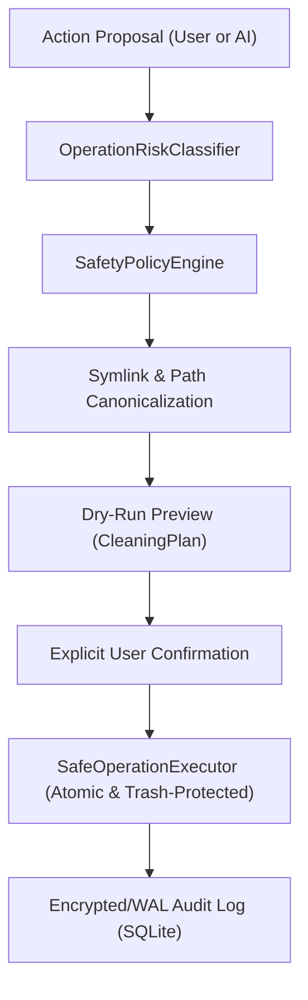

# 🛡️ Security Policy & Zero-Harm Architecture

MacOptimizer is designed from the ground up as a **security-first, defense-in-depth macOS system health and optimization toolkit**. We believe that any software interacting with system resources, memory, and storage must adhere to the highest standard of safety, transparency, and auditability.

---

## 🔒 Zero-Harm Architecture (Defense-in-Depth)

MacOptimizer enforces multiple layers of validation before any filesystem, process, or maintenance action is executed:

### 1. Strict Path Protection & Anti-Data Loss
* **System Roots Protection**: Hardcoded boundaries preventing any deletion or write inside `/`, `/System`, `/System/Applications`, `/System/Library`, `/Library`, `/usr`, `/bin`, `/sbin`, `/var`, `/etc`, `/dev`, `/private`, `/Volumes`, `/cores`, `/opt`.
* **User Data Protection**: Strict guards around user root directories (`~`, `~/Desktop`, `~/Documents`, `~/Downloads`, `~/Movies`, `~/Music`, `~/Pictures`, `~/Library`, `~/Library/Keychains`, `~/Library/Mail`, `~/.ssh`, `~/.gnupg`, `~/.aws`, `~/.config`).
* **Symlink Attack Resistance**: All paths are resolved to their canonical destination using `URL.resolvingSymlinksInPath()` prior to evaluating safety policies, neutralizing symlink-based traversal attacks.
* **Safe Removal Fallback**: Non-cache items are moved to the user's macOS Trash (`FileManager.trashItem`) rather than being unlinked directly.

### 2. Process Termination Protection (Anti-Kernel Panic)
* **Kernel & Init Guards**: Hard protection for PID 0 (`kernel_task`), PID 1 (`launchd`), and MacOptimizer's own process.
* **macOS System Daemons Whitelist**: 35+ critical background processes (`WindowServer`, `loginwindow`, `diskarbitrationd`, `securityd`, `opendirectoryd`, `coreauthd`, `syspolicyd`, `tccd`, `trustd`, `Dock`, `Finder`, `SystemUIServer`, `ControlCenter`, `mds`, `powerd`, etc.) cannot be killed under any circumstances.

### 3. Sandboxed Command Execution
* No arbitrary shell string execution (`/bin/sh` or `/bin/zsh`).
* Whitelisted binaries only (`ApprovedExecutable`: `dscacheutil`, `killall`, `mdutil`, `qlmanage`).
* 15-second watchdog timer automatically terminates hanging child processes.

### 4. Secret & API Key Management
* Cloud AI credentials (e.g. NVIDIA NIM API keys, custom tokens) are stored exclusively in the **macOS Keychain** (`Security.framework` with `kSecAttrAccessibleWhenUnlockedThisDeviceOnly`).
* Secrets are never logged, never saved in plaintext `UserDefaults`, and excluded from bug reports.

---

## 🎯 STRIDE Threat Model

| Threat Category | Potential Attack Vector | Mitigation in MacOptimizer |
| :--- | :--- | :--- |
| **Spoofing** | Rogue processes impersonating legitimate apps | Binary Mach-O header verification and code signing check. |
| **Tampering** | Symlinks pointing from cache dirs to user documents | `URL.resolvingSymlinksInPath()` canonical path verification. |
| **Repudiation** | Unverified file or process actions | Strict audit logging in WAL-mode SQLite database. |
| **Information Disclosure** | Cloud AI exfiltrating private files | System prompts only include anonymous hardware counters. System data never leaves device without explicit user action. |
| **Denial of Service** | Purging active system memory or killing WindowServer | `ProcessProtectionPolicy` and safe memory clamped limits (`64 MB - 256 MB`). |
| **Elevation of Privilege** | Sudo escalation via unapproved commands | `SandboxedCommandRunner` strictly whitelists safe macOS utilities without root requirements. |

---

## 🚨 Reporting a Vulnerability

We welcome responsible security disclosures. If you discover a security vulnerability in MacOptimizer:

1. **Do NOT open a public GitHub issue.**
2. Send a detailed report via email to: **security@osmancagrigenc.dev** (or submit via [GitHub Private Vulnerability Reporting](https://github.com/osmancagrigenc/MacOsOptimizer/security/advisories/new)).
3. Include:
   * Description of the vulnerability and affected versions.
   * Step-by-step reproduction steps or proof-of-concept.
   * Potential impact.
4. We will acknowledge receipt within 48 hours and provide an estimated remediation timeline.
